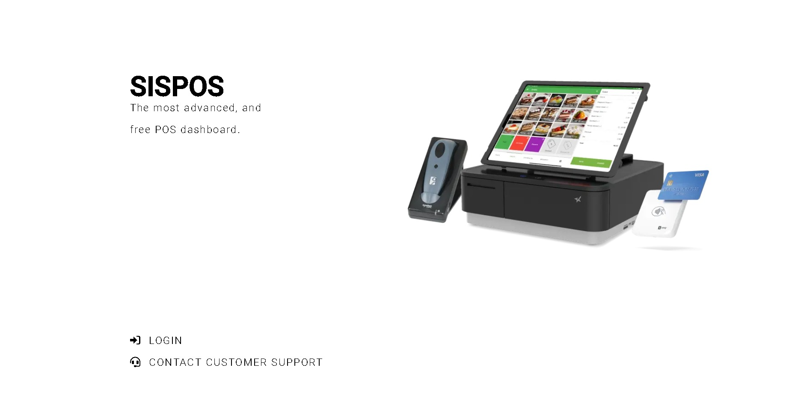
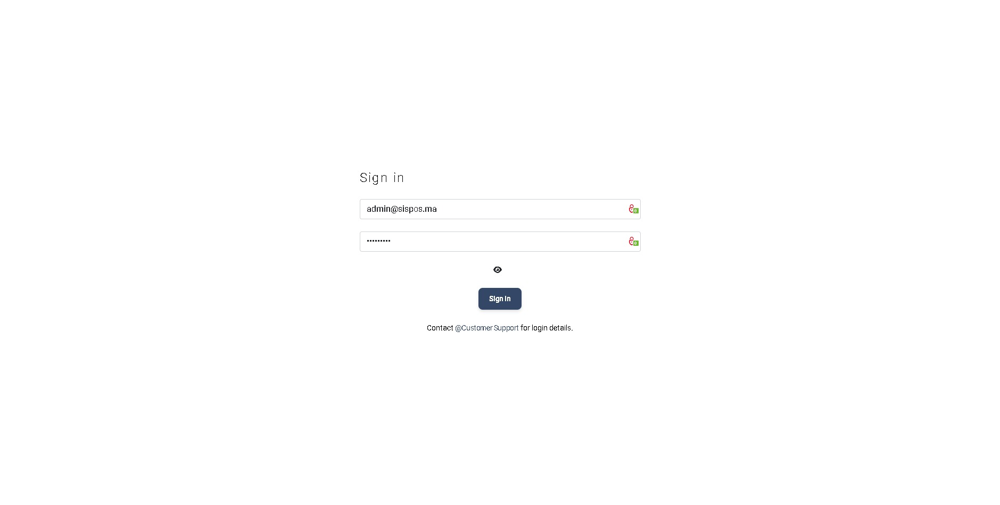

# 

# SISPOS Dashboard

A modern and clean POS Dashboard built using the PEAN Stack.

---

## 🚀 Technologies

### **Frontend:**
- [Angular](https://angular.io) - Framework for building web applications.
- [Angular Material](https://material.angular.io) - UI components for Angular.
- [Bootstrap](https://getbootstrap.com) - CSS framework for responsive design.
- [SweetAlert2](https://sweetalert2.github.io) - Stylish popup notifications.

### **Backend:**
- [PostgreSQL](https://www.postgresql.org) - Relational database management system.
- [Express](https://expressjs.com) - Web application framework.
- [Node.js](https://nodejs.org/en/) - JavaScript runtime.

### **APIs:**
- [SISAPI](https://sispos-api.herokuapp.com) - Custom backend API.
- [CountryFlagsAPI](https://countryflagsapi.com) - Country flag images.

---

## 🎯 Features

- Full C.R.U.D Operations (Create, Read, Update, Delete)
- Local Data Storage (PostgreSQL)
- Simple & Fast Deployment
- Custom API Integration
- User-friendly Interface

---

## 📸 Screenshots

### **Main Page:**


### **Login Page:**


### **Dashboard:**


### **Data Tables:**
- Clients Table: 
- Categories Table: 

### **Task Manager:**


---

## 🎨 Color Palette

| Color             | Hex Value                                                         |
| ----------------- | ------------------------------------------------------------------ |
| Whitesmoke        |  #F5F5F5 |
| Sky Gradient      |  #2980B9 -  #6DD5FA |
| Primary Gradient  |  #4A00E0 -  #8E2DE2 |
| Warning Gradient  |  #f5af19 -  #f12711 |
| Light Gradient    |  #78ffd6 -  #a8ff78 |
| Info Gradient     |  #5D26C1 -  #a17fe0 |
| Danger Gradient   |  #93291E -  #ED213A |

---

## 🧩 API Reference

### SISAPI
- Full API Documentation: [SISAPI GitHub Repository](https://github.com/RedaBoi12/sisapi)

### CountryFlagsAPI
```http
GET /${file-type}/${country}
```
| Parameter    | Type     | Description                     |
|--------------|----------|---------------------------------|
| `file-type`  | `string` | Required. PNG or SVG format    |
| `country`    | `string` | Required. Country code or name |

---

## 🌐 Test Online

[Live Demo](https://sispos-dashboard.herokuapp.com)

---

## 🏃 Run Locally

1. Clone the project:
```bash
  git clone https://github.com/RedaBoi12/sispos.git
```
2. Navigate to the project directory:
```bash
  cd sispos
```
3. Install dependencies:
```bash
  npm install
```
4. Start the development server:
```bash
  ng serve
```

---

## 🛣️ Roadmap

- Add Browser Support Enhancements
- Improve Code Optimization

---

## 🤝 Support

For any issues, contact: **redabusiness10@gmail.com**

---

## 💡 FAQ

**Q: How long did this project take?**
- A: Less than a month.

**Q: Do you plan on updating it?**
- A: No, this project was built primarily for learning Angular.

---

## 👨‍💻 About Me

Hello, my name is **[ElGoumri Reda](https://www.github.com/RedaBoi12)**. I created SISPOS as my second Angular project to gain a deeper understanding of the framework.

---

## 🛠️ Skills

**Languages:** HTML, CSS, JavaScript, TypeScript  
**Frameworks & Tools:** Bootstrap, Angular, Express, Node.js, PostgreSQL

---

## 📚 Lessons Learned

Working on SISPOS significantly enhanced my front-end development skills. I faced multiple challenges, particularly:

- **API Integration:** Learning how to interact with APIs using Angular's HttpClient module.
- **Data Management:** Handling and displaying data using Observables.
- **Backend Development:** Building a full P.E.N REST API from scratch and linking it to the project.

Every bug encountered and solved helped deepen my understanding of Angular and modern web development.

---

Thank you for exploring SISPOS Dashboard! 🚀

